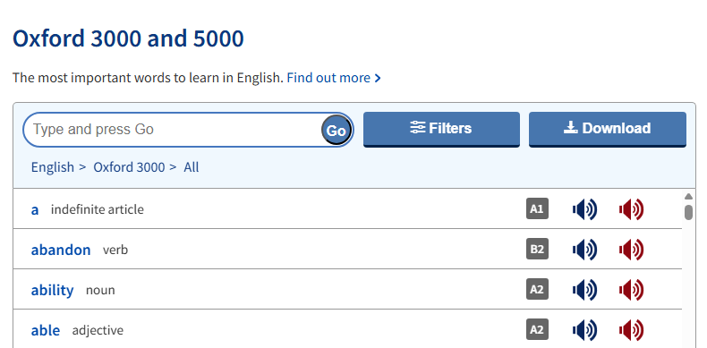
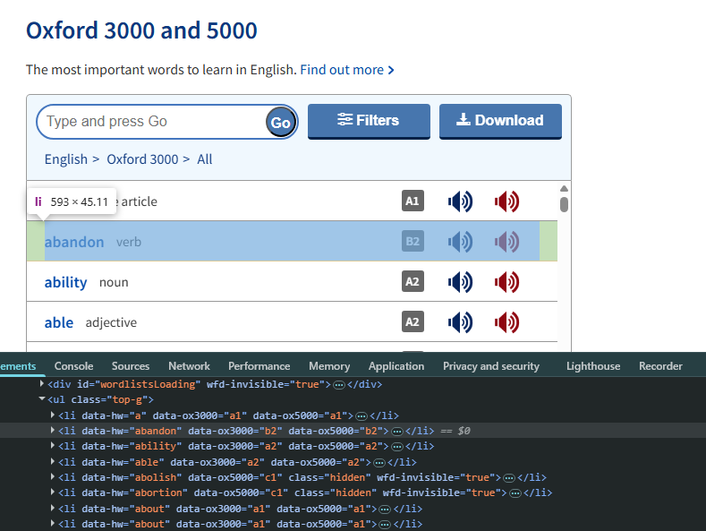
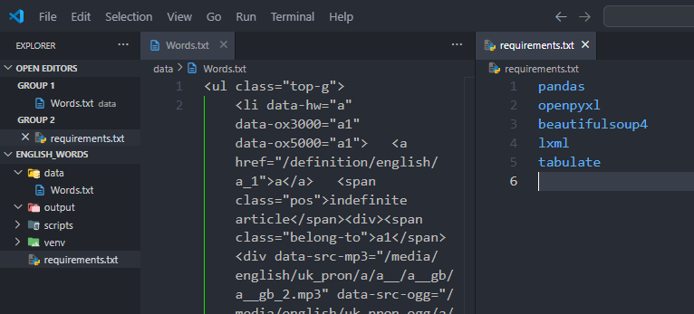
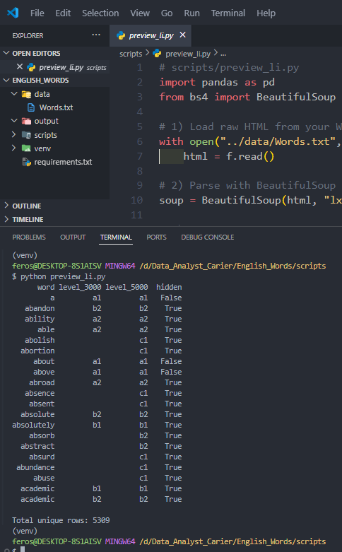
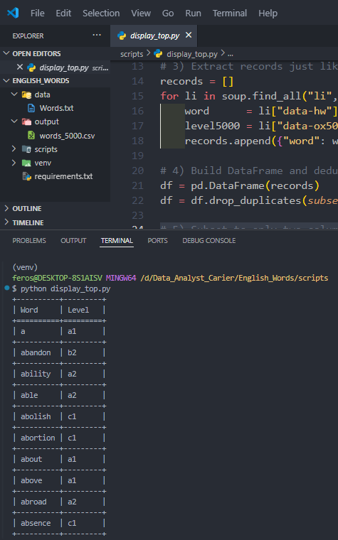
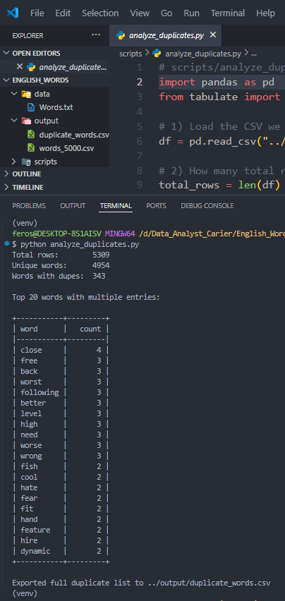
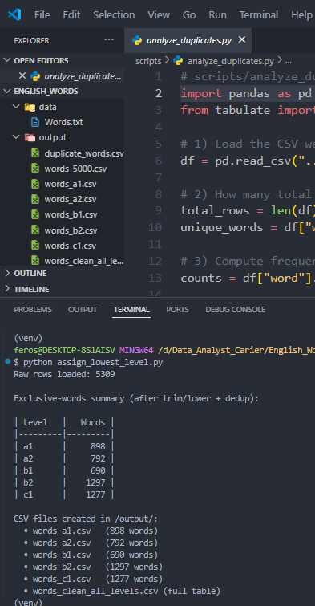

# English Words Analyzer 🇬🇧🛠️

> **Projekt na extrakciu, čistenie a analýzu 5000 najdôležitejších anglických slov zo stránky Oxford 3000/5000**  
> _Riešené pomocou Pythonu, BeautifulSoup, Pandas a dátovej analytiky_

---

## 🚩 Úvod / Motivácia

Chcel som si pripraviť **najpoužívanejšie anglické slová** na učenie pre aplikáciu [DuoCards](https://www.duocards.com/) – úrovne A1 → C1.  
Oxford 3000 a 5000 síce ponúka zoznam, ale export do PDF je nepoužiteľný:

- rozhádzaný text, špeciálne znaky
- triedenie podľa levelu manuálne zaberie hodiny

Preto som použil **Python** a automatizované parsovanie HTML, aby som získal čistý dataset.

---

## 🧑‍💻 Ako som to riešil

1. **Zdroj dát** – [Oxford 3000/5000](https://www.oxfordlearnersdictionaries.com/wordlist/english/oxford3000/)  
   V Developer Tools som našiel `<li>` s atribútmi `data-ox3000/5000`.

2. **Export HTML** – celý `<ul>` uložený do `data/Words.txt`.

3. **Parsovanie & analýza**
   - [BeautifulSoup](https://www.crummy.com/software/BeautifulSoup/) + Pandas
   - Deduplikácia, normalizácia úrovní
   - Export CSV po leveloch (`words_a1.csv`, …)

---

## 🗂️ Štruktúra projektu

```text
English_Words/
├─ data/
│  └─ Words.txt
├─ output/
│  ├─ words_5000.csv
│  ├─ words_a1.csv
│  ├─ words_a2.csv
│  ├─ words_b1.csv
│  └─ words_clean_all_levels.csv
├─ scripts/
│  ├─ preview_li.py
│  ├─ display_top.py
│  ├─ analyze_duplicates.py
│  └─ assign_lowest_level.py
├─ requirements.txt
├─ .gitignore
└─ README.md
```

---

## ⚙️ Použité technológie

- **Python 3.x**
- [pandas](https://pandas.pydata.org/)
- [beautifulsoup4](https://www.crummy.com/software/BeautifulSoup/)
- [lxml](https://lxml.de/)
- [tabulate](https://pypi.org/project/tabulate/)
- (voliteľne: _openpyxl_ na Excel)

---

## 📋 Workflow (krok za krokom)

### 1. Klonovanie repozitára

```bash
git clone https://github.com/Begriper/english-words-analyzer.git
cd english-words-analyzer
```

### 2. Inštalácia závislostí

```bash
pip install -r requirements.txt
```

### 3. Spustenie skriptov

```bash
python scripts/preview_li.py
python scripts/display_top.py
python scripts/analyze_duplicates.py
python scripts/assign_lowest_level.py
```

---

## 💡 Prečo toto celé?

- Zautomatizovať parsovanie a čistenie dát, ktoré by ručne trvali hodiny
- Vytvoriť študijný dataset anglických slov pre A1–C1 podľa Oxfordu
- Naučiť sa Python v praxi (parsovanie, data-wrangling)
- Pripraviť dáta na import do DuoCards či podobných aplikácií

---

## 📸 Výsledky a workflow v obrázkoch

1. **Ukážka rozhrania Oxford 3000/5000**
   

2. **HTML `<li>` elementy v Developer Tools**
   

3. **Surový `Words.txt` (HTML)**
   

4. **Výstup `preview_li.py`**
   

5. **Výstup `display_top.py`**
   

6. **Výstup `analyze_duplicates.py`**
   

7. **Výstup `assign_lowest_level.py`**
   

---

## 🧠 Autor & kontakt

Projekt vznikol počas mojej cesty dátového analytika – cieľ: zjednodušiť si učenie angličtiny a ukázať workflow.

- **GitHub:** [Begriper](https://github.com/Begriper)
- **LinkedIn:** [František Stolár](https://www.linkedin.com/in/františek-stolár-3796ab2b5/)
